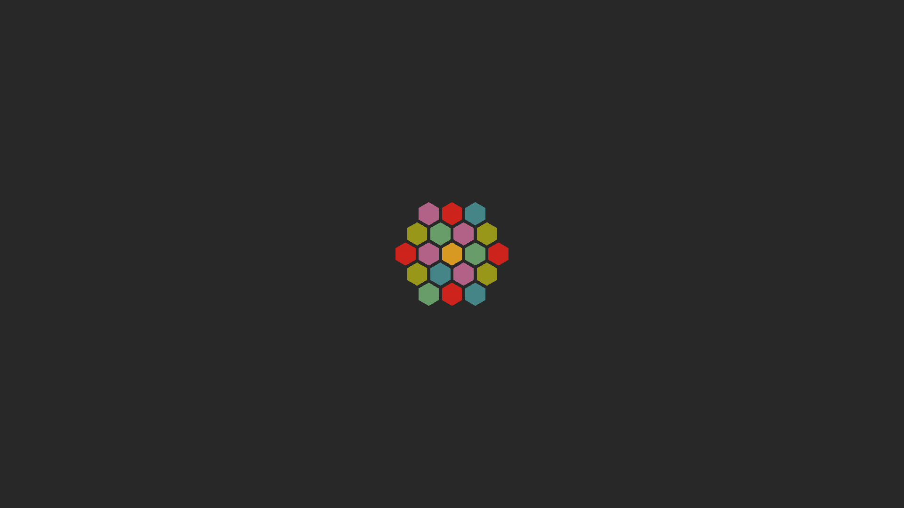

## Hexagon Plymouth theme, recolored for gruvbox

This is a theme [Hexagon Alt](https://raw.githubusercontent.com/adi1090x/files/master/plymouth-themes/previews/36.gif) from [@adi1090x](https://github.com/adi1090x/)'s [`plymouth-themes`](https://github.com/adi1090x/plymouth-themes), recolored for [gruvbox theme](https://github.com/morhetz/gruvbox).

## Preview:

## Installation

### Arch

There exists an AUR package [`plymouth-theme-hexagon-alt-gruvbox`](https://aur.archlinux.org/packages/plymouth-theme-hexagon-alt-gruvbox).

### Manual installation

Follow the same instructions as for [`plymouth-themes`](https://github.com/adi1090x/plymouth-themes)

### Credits

* [@adi1090x](https://github.com/adi1090x/) for original [plymouth themes](https://github.com/adi1090x/plymouth-themes)
* [@morhetz](https://github.com/morhetz) for original [gruvbox theme](https://github.com/morhetz/gruvbox)
